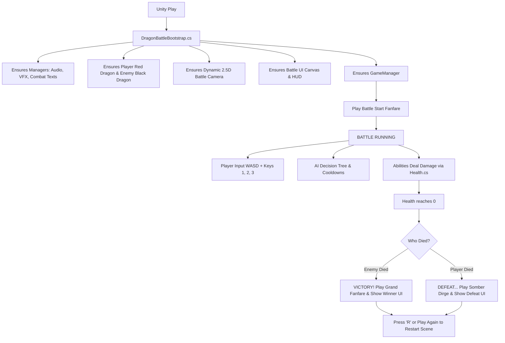

# Dragon Battle 2.5D - Codebase & Architecture Guide 🐉⚔️

This guide explains **how the whole game works**, how the systems talk to each other, and provides a **simple, plain-language walkthrough of every single script** in the project.

---

## 🎮 1. High-Level Game Flow: How The Program Runs

When you press **Play** in the Unity Editor:

---

## 📁 2. File-by-File Walkthrough

---

### 🏛️ Core System (`Assets/Scripts/Core/`)

#### 1. [`DragonBattleBootstrap.cs`](file:///Users/bhartinder/Development%20Projects/Test%20Assesment/Assets/Scripts/Core/DragonBattleBootstrap.cs)
- **What it does in simple terms**: The **"Safety Architect"**.
- **Role**: If you open a completely empty scene or miss any component in the Hierarchy, this script automatically sets up the Player Dragon, Enemy Dragon, Camera, Sound System, Visual Effects, and UI HUD so the game **never breaks and runs instantly**.

#### 2. [`GameManager.cs`](file:///Users/bhartinder/Development%20Projects/Test%20Assesment/Assets/Scripts/Core/GameManager.cs)
- **What it does in simple terms**: The **"Referee & Match Coordinator"**.
- **Role**:
  - Starts the battle immediately on launch.
  - Tracks match time.
  - Listens to dragon deaths to declare either **VICTORY** (if AI dragon dies) or **DEFEAT** (if Player dies).
  - Handles game restarts (via the Play Again button or pressing `R`).

#### 3. [`DragonController.cs`](file:///Users/bhartinder/Development%20Projects/Test%20Assesment/Assets/Scripts/Core/DragonController.cs)
- **What it does in simple terms**: The **"Dragon Master Class"** (Shared base for both Player and Enemy).
- **Role**:
  - Handles smooth acceleration, deceleration (braking), and gradual rotation towards movement directions.
  - Controls animations (Walk, Attack1, Attack2, Fly, TakeHit, Die).
  - Holds list of abilities (`FireBreath`, `TailAttack`, `FlyAttack`).
  - Locks ground movement during aerial flights or attack animations so attacks don't slide.

---

### 🕹️ Player & AI (`Assets/Scripts/Player/` & `Assets/Scripts/AI/`)

#### 4. [`PlayerDragonController.cs`](file:///Users/bhartinder/Development%20Projects/Test%20Assesment/Assets/Scripts/Player/PlayerDragonController.cs)
- **What it does in simple terms**: The **"Player's Controller"**.
- **Role**:
  - Reads player inputs: **W/A/S/D** or Arrow Keys for smooth movement.
  - Reads **Number Keys (1, 2, 3)** or Mouse clicks on HUD icons to trigger abilities.
  - Ensures the player dragon faces its movement target or ability aim direction.

#### 5. [`DragonAIController.cs`](file:///Users/bhartinder/Development%20Projects/Test%20Assesment/Assets/Scripts/AI/DragonAIController.cs)
- **What it does in simple terms**: The **"Smart Enemy Dragon Brain"**.
- **Role**:
  - Uses state-machine behavior: **Chase**, **Reposition/Orbit**, **Attack**, and **Recovery**.
  - **Balanced gameplay**: Holds its ground when the player takes to the skies for a Fly Attack.
  - Chooses attacks based on distance:
    - Close range: Uses Tail Attack.
    - Medium range: Uses Fire Breath.
    - Long range: Uses Sky Dive / Fly Attack.
  - Has cooldown timers between attacks to give the player room to counter-play.

---

### 💥 Abilities System (`Assets/Scripts/Abilities/`)

#### 6. [`AbilityType.cs`](file:///Users/bhartinder/Development%20Projects/Test%20Assesment/Assets/Scripts/Abilities/AbilityType.cs)
- **What it does in simple terms**: Enum defining the 3 abilities: `FireBreath`, `TailAttack`, `FlyAttack`.

#### 7. [`AbilityBase.cs`](file:///Users/bhartinder/Development%20Projects/Test%20Assesment/Assets/Scripts/Abilities/AbilityBase.cs)
- **What it does in simple terms**: The **"Blueprint for all Attacks"**.
- **Role**: Handles cooldown timers, energy/cost, animation triggers, and ability icons.

#### 8. [`FireBreathAbility.cs`](file:///Users/bhartinder/Development%20Projects/Test%20Assesment/Assets/Scripts/Abilities/FireBreathAbility.cs)
- **What it does in simple terms**: **Ability 1 (Fire Cone)**.
- **Role**: Shoots a stream of fire particles in front of the dragon over 1.2 seconds, dealing multi-tick burning damage to anyone caught inside the cone.

#### 9. [`TailAttackAbility.cs`](file:///Users/bhartinder/Development%20Projects/Test%20Assesment/Assets/Scripts/Abilities/TailAttackAbility.cs)
- **What it does in simple terms**: **Ability 2 (Tail Whip / Melee)**.
- **Role**: Performs a 360-degree tail sweep, dealing quick burst damage, knocking back the target, and spawning slash VFX.

#### 10. [`FlyAttackAbility.cs`](file:///Users/bhartinder/Development%20Projects/Test%20Assesment/Assets/Scripts/Abilities/FlyAttackAbility.cs)
- **What it does in simple terms**: **Ability 3 (Sky Dive / Aerial Slam)**.
- **Role**:
  - Launches the dragon into the sky with wing trails.
  - Tracks and homes in directly above the opponent's position.
  - Plunges downward with an explosive impact, screen shake, and heavy ground shockwave damage.

---

### ⚔️ Combat & Health (`Assets/Scripts/Combat/`)

#### 11. [`IDamageable.cs`](file:///Users/bhartinder/Development%20Projects/Test%20Assesment/Assets/Scripts/Combat/IDamageable.cs) & [`DamageInfo.cs`](file:///Users/bhartinder/Development%20Projects/Test%20Assesment/Assets/Scripts/Combat/DamageInfo.cs)
- **What they do in simple terms**: The **"Damage Contract"**. Any object or dragon that can take damage implements this interface. `DamageInfo` carries amount, source, and knockback vector.

#### 12. [`Health.cs`](file:///Users/bhartinder/Development%20Projects/Test%20Assesment/Assets/Scripts/Combat/Health.cs)
- **What it does in simple terms**: The **"Life & Hitpoint Tracker"**.
- **Role**:
  - Manages current/max HP.
  - Triggers hit reactions, invulnerability frames (if any), damage numbers, and death events.

#### 13. [`FloatingDamageText.cs`](file:///Users/bhartinder/Development%20Projects/Test%20Assesment/Assets/Scripts/Combat/FloatingDamageText.cs) & [`FloatingTextManager.cs`](file:///Users/bhartinder/Development%20Projects/Test%20Assesment/Assets/Scripts/Combat/FloatingTextManager.cs)
- **What they do in simple terms**: **"Floating RPG Combat Numbers"**.
- **Role**: Pops up animated floating damage numbers above dragons when damaged (red for normal, bright yellow for crits), which rise and fade away.

---

### 🎥 Camera (`Assets/Scripts/Camera/`)

#### 14. [`BattleCameraController.cs`](file:///Users/bhartinder/Development%20Projects/Test%20Assesment/Assets/Scripts/Camera/BattleCameraController.cs)
- **What it does in simple terms**: **"Dynamic 2.5D Arena Camera"**.
- **Role**:
  - Tracks the midpoint between both dragons smoothly.
  - Automatically zooms in when dragons get close and zooms out when they fly or separate.
  - Performs smooth screen shakes during heavy attacks (like Fly Slam and Tail strikes).

---

### ✨ Visual Effects & Particles (`Assets/Scripts/VFX/`)

#### 15. [`ProceduralVFXGenerator.cs`](file:///Users/bhartinder/Development%20Projects/Test%20Assesment/Assets/Scripts/VFX/ProceduralVFXGenerator.cs)
- **What it does in simple terms**: **"The Particle VFX Factory"**.
- **Role**: Generates fire streams, shockwave rings, hit sparks, ground impact smoke, and wing trails without requiring heavy external asset packs.

#### 16. [`ParticleManager.cs`](file:///Users/bhartinder/Development%20Projects/Test%20Assesment/Assets/Scripts/VFX/ParticleManager.cs)
- **What it does in simple terms**: **"VFX Spawner & Clean-up Pool"**.
- **Role**: Spawns VFX at exact positions and automatically deletes/cleans them up after use to prevent memory waste.

---

### 🔊 Audio System (`Assets/Scripts/Audio/`)

#### 17. [`SoundManager.cs`](file:///Users/bhartinder/Development%20Projects/Test%20Assesment/Assets/Scripts/Audio/SoundManager.cs)
- **What it does in simple terms**: **"Complete Audio & Music Synthesis Engine"**.
- **Features**:
  - **Battle Start**: Resonant war horn and battle gong fanfare.
  - **Victory**: Multi-layered triumphant major brass fanfare and chime bells.
  - **Defeat**: Deep doom gong and somber descending minor dirge.
  - **Attacks & Impacts**: Fire roar, tail whoosh, sub-bass sky slam explosion, dragon roar, cooldown ready chime, and UI clicks.

---

### 🖥️ User Interface (`Assets/Scripts/UI/`)

#### 18. [`OverheadHealthBar.cs`](file:///Users/bhartinder/Development%20Projects/Test%20Assesment/Assets/Scripts/UI/OverheadHealthBar.cs)
- **What it does in simple terms**: **"Top/Overhead Health Bars"**.
- **Role**: Displays dragon name, current numeric HP (`1000 / 1000 HP`), smooth green/red health bar fill, and smooth yellow "damage lag" bar.

#### 19. [`AbilitySlotUI.cs`](file:///Users/bhartinder/Development%20Projects/Test%20Assesment/Assets/Scripts/UI/AbilitySlotUI.cs)
- **What it does in simple terms**: **"HUD Ability Icons & Cooldown Radial"**.
- **Role**: Shows skill icon, hotkey badge (1, 2, 3), skill name, and a 360° radial cooldown sweep with countdown timer text.

#### 20. [`BattleUIManager.cs`](file:///Users/bhartinder/Development%20Projects/Test%20Assesment/Assets/Scripts/UI/BattleUIManager.cs)
- **What it does in simple terms**: **"Master Canvas Controller"**.
- **Role**:
  - Connects HUD bars with Player and AI dragons.
  - Updates battle timer in real-time.
  - Displays the **Victory / Defeat Screen** with match stats and the "Play Again (R)" button when a dragon falls.

---

## 🕹️ Controls Quick Reference
| Key / Input | Action |
| :--- | :--- |
| **W, A, S, D** / Arrow Keys | Move Red Dragon |
| **1** or Left Skill Icon | Fire Breath (Burning Cone) |
| **2** or Middle Skill Icon | Tail Whip (360° Melee Knockback) |
| **3** or Right Skill Icon | Sky Dive (Aerial Homing Slam) |
| **R** / Space / Enter | Restart Match (on Game Over screen) |
